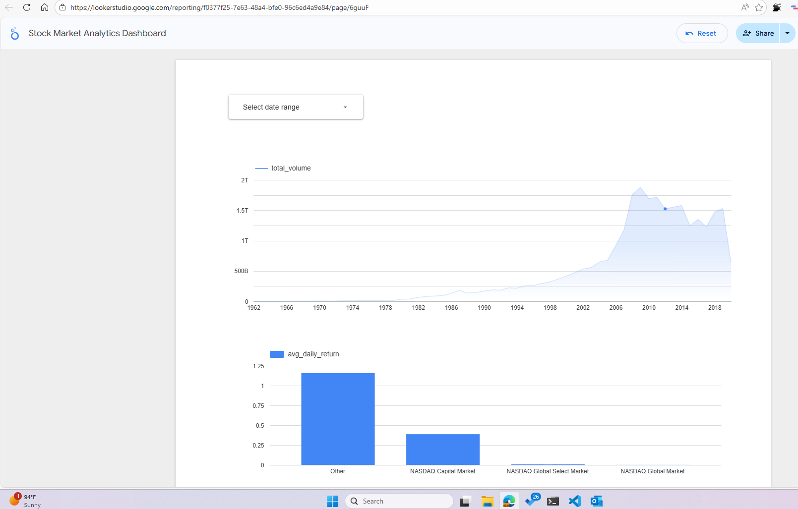

# Stock Market Analytics Pipeline

A batch data pipeline that processes 60 years of stock market data for 8,000+ tickers — from raw CSV files all the way to an interactive dashboard.

Built as the capstone project for the [DataTalksClub Data Engineering Zoomcamp 2026](https://github.com/DataTalksClub/data-engineering-zoomcamp).

---

## What this project does

I wanted to explore how stock market trading activity has changed over the decades. This pipeline takes daily price data for every NASDAQ-listed stock and ETF from 1962 to 2020, computes technical indicators like moving averages and volatility, loads it all into BigQuery, and visualizes the trends in a dashboard.

The interesting part isn't just the final charts — it's watching how trading volume exploded after the internet era, or seeing the 2008 financial crisis show up as a massive spike right in the data.

---

## Dashboard



**Tile 1 (Temporal):** Total trading volume across all tickers from 1962 to 2020 — the growth is dramatic, especially post-2000.

**Tile 2 (Categorical):** Average daily return by market category — shows which market segments have historically delivered better returns.

[View live dashboard →](https://lookerstudio.google.com/reporting/f0377f25-7e63-48a4-bfe0-96c6ed4a9e84/page/6guuF)

---

## Architecture

```
Kaggle Dataset (CSV files)
        │
        ▼
Google Cloud Storage          ← raw data lake
(gs://dezoomcampstore/)
        │
        ▼
Apache Spark (PySpark)        ← compute metrics, join metadata
        │
        ▼
Google Cloud Storage          ← processed Parquet files
(partitioned by year)
        │
        ▼
BigQuery                      ← data warehouse
(raw_daily_prices, raw_symbols_meta)
        │
        ▼
dbt Core (Dockerized)         ← SQL transformations
(staging → star schema → aggregations)
        │
        ▼
Looker Studio                 ← dashboard
```

The whole pipeline is orchestrated by an Airflow DAG running on GCP Cloud Composer.

---

## Tech Stack

| Layer | Tool |
|---|---|
| Orchestration | Apache Airflow (Cloud Composer 2) |
| Data Lake | Google Cloud Storage |
| Processing | PySpark 4.1.1 |
| Data Warehouse | BigQuery |
| Transformations | dbt Core + dbt-bigquery |
| Dashboard | Looker Studio |
| Containerization | Docker |
| Infrastructure | GCP (manually provisioned) |

---

## Dataset

**Source:** [Stock Market Dataset on Kaggle](https://www.kaggle.com/datasets/jacksoncrow/stock-market-dataset)

- 8,049 individual CSV files — one per ticker (stocks + ETFs)
- Daily OHLCV data: Open, High, Low, Close, Adjusted Close, Volume
- Date range: 1962-01-02 to 2020-04-01
- Total rows after processing: **26,228,008**
- Metadata file: company names, exchanges, market categories

---

## Data Model

The pipeline produces 8 tables in BigQuery across 4 layers:

```
raw_daily_prices  ──►  stg_daily_prices  ──►  fact_daily_prices  ──►  agg_sector_performance
raw_symbols_meta  ──►  stg_symbols_meta  ──►  dim_companies       ──►  agg_monthly_summary
```

**Why partitioned and clustered?**

`fact_daily_prices` is partitioned by `trade_date` (month granularity) and clustered by `symbol`. Most queries filter by date range and/or ticker symbol — partitioning means BigQuery skips irrelevant months entirely instead of scanning all 26 million rows, and clustering co-locates rows for the same ticker within each partition. On a 26M row table this makes a real difference in both query speed and cost.

See [docs/data_model.md](docs/data_model.md) for the full schema with every column documented.

---

## Computed Metrics (from Spark)

For every ticker on every trading day, the Spark job computes:

| Metric | Description |
|---|---|
| `daily_return` | `(close - prev_close) / prev_close` — how much the stock moved today |
| `moving_avg_30` | Rolling average of close price over last 30 trading days |
| `moving_avg_60` | Rolling average of close price over last 60 trading days |
| `volatility_30` | Rolling standard deviation of daily return over 30 days (risk measure) |
| `week52_high` | Highest price over the last 252 trading days |
| `week52_low` | Lowest price over the last 252 trading days |

---

## How to reproduce this

### Prerequisites
- GCP project with BigQuery and GCS enabled
- Service account JSON key with BigQuery + GCS permissions
- Python 3.11+, Java 17 (for PySpark)
- Docker Desktop
- Kaggle API token

### 1. Clone the repo
```bash
git clone https://github.com/nextaxtion/stock-market-analytics-pipeline.git
cd stock-market-analytics-pipeline
python -m venv .venv && source .venv/bin/activate
pip install -r requirements.txt
```

### 2. Set credentials
```bash
export GOOGLE_APPLICATION_CREDENTIALS=/path/to/your/service-account-key.json
```

### 3. Download and upload raw data
```bash
# Download from Kaggle
kaggle datasets download -d jacksoncrow/stock-market-dataset --unzip -p data/

# Upload to GCS
gsutil -m cp -r data/stocks/ gs://YOUR_BUCKET/security-market-raw-data/
gsutil -m cp -r data/etfs/   gs://YOUR_BUCKET/security-market-raw-data/
gsutil cp data/symbols_valid_meta.csv gs://YOUR_BUCKET/security-market-raw-data/
```

### 4. Run Spark processing
```bash
python spark/process_stock_data.py --mode local
```

### 5. Load to BigQuery
```bash
python scripts/load_to_bigquery.py
```

### 6. Run dbt transformations
```bash
# Copy and fill in your credentials
cp dbt/profiles.yml.example dbt/profiles.yml

# Run with Docker
docker compose -f docker/docker-compose.yml build
docker compose -f docker/docker-compose.yml run --rm dbt run
docker compose -f docker/docker-compose.yml run --rm dbt test
```

### 7. Run the full pipeline via Airflow
Deploy `airflow/dags/stock_market_dag.py` to your Cloud Composer environment and trigger the `stock_market_pipeline` DAG manually.

---

## Project structure

```
├── airflow/dags/          # Airflow DAG (full pipeline orchestration)
├── spark/                 # PySpark processing script
├── scripts/               # BigQuery load script
├── dbt/
│   ├── models/staging/    # Cleaning + renaming layer (views)
│   ├── models/core/       # Star schema: dim_companies + fact_daily_prices
│   ├── models/aggregations/ # Dashboard-ready summaries
│   └── tests/             # Data quality tests (22 passing)
├── docker/                # Dockerfile + docker-compose for dbt
├── docs/                  # Architecture diagram, dashboard screenshot, data model
└── terraform/             # GCP infrastructure (optional)
```

---

## Data quality

dbt runs 23 automated tests on every pipeline run:
- `not_null` checks on all key columns
- `unique` checks on primary keys
- `accepted_values` on market category codes
- FK relationship check between fact and dimension tables

Result: **22 PASS, 1 WARN** (the warning is expected — some historical tickers have price data but no metadata entry because they were delisted before the metadata snapshot was taken).

